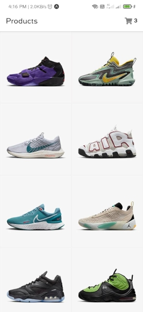
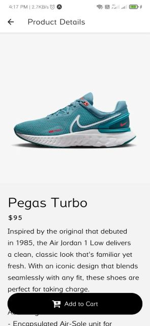

# Nike App Clone
Nike app clone using React Native and Expo with Redux Toolkit.

## Installation
1. Clone the repo
```sh
git clone
```
2. Install NPM packages
```sh
npm install
```
3. Run the app
```sh
npx expo start
```

## Screenshots

